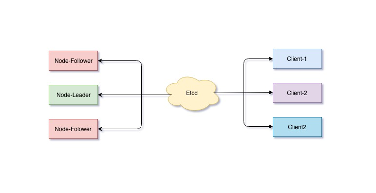
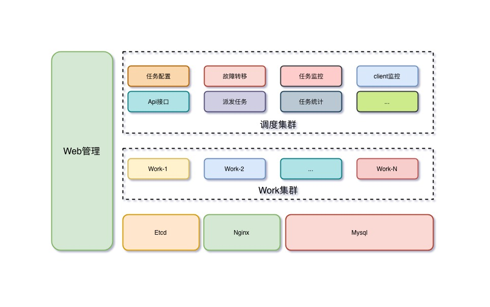
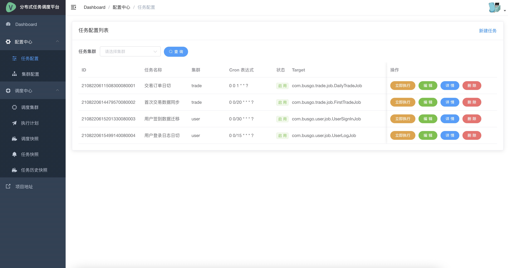
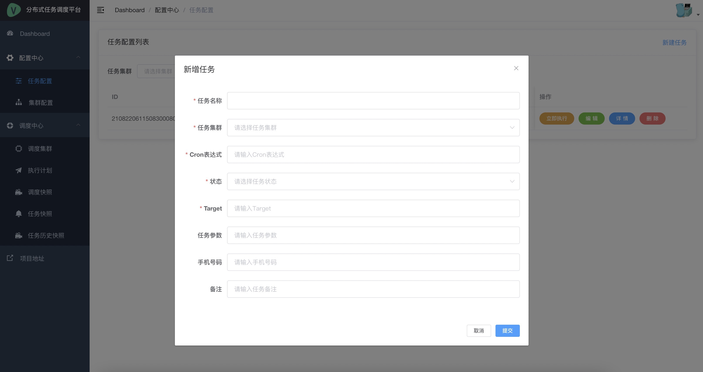
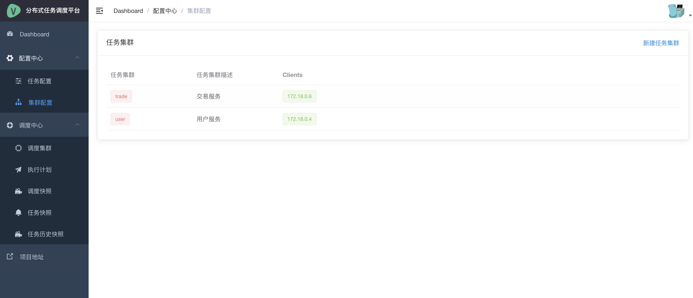
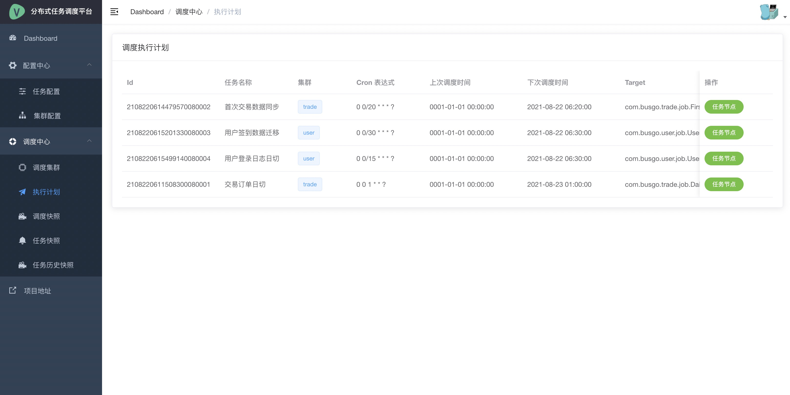
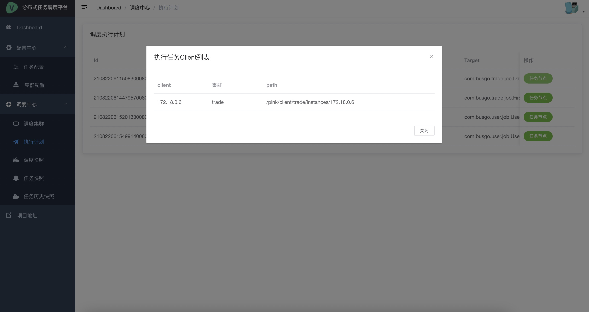
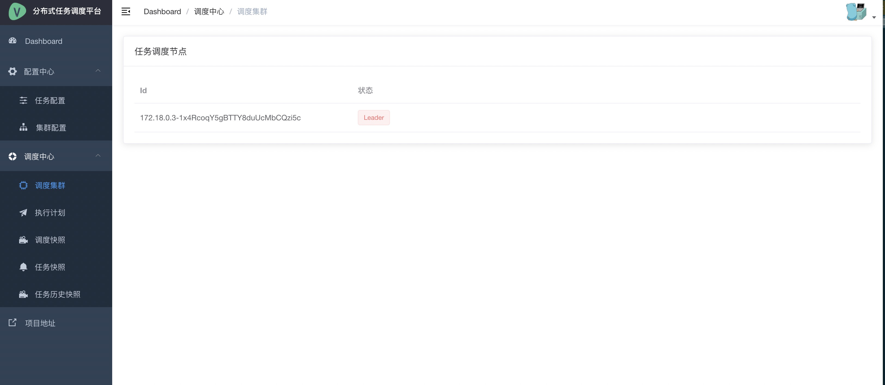
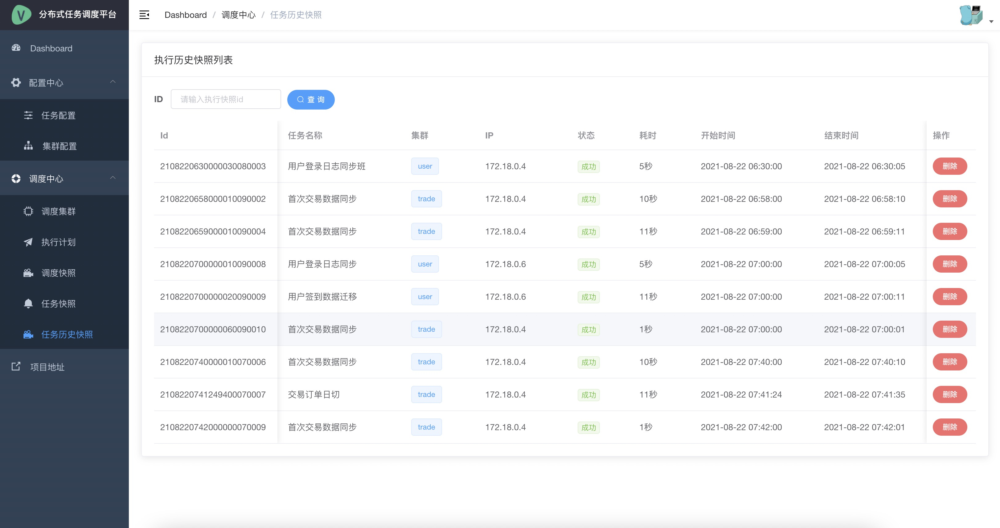
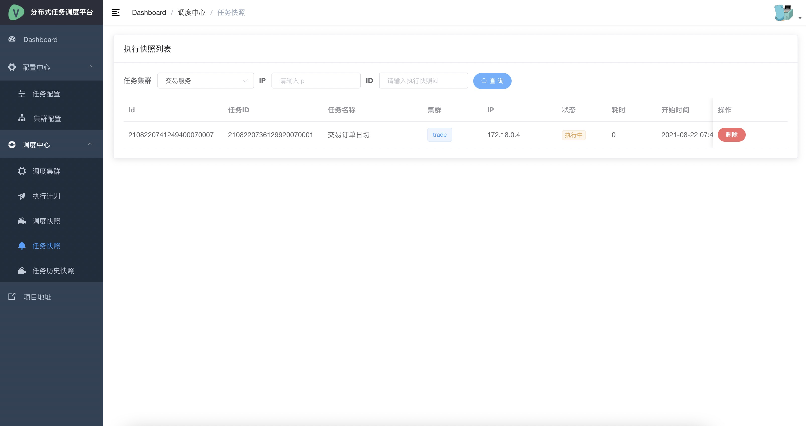

#   分布式任务调度平台

> 演示地址:http://122.51.106.217:8001

## 前言

在企业系统开发过程中难免少不了一些定时任务来进行定时触发执行任务，对于非分布式环境系统中，我们只需要在对应系统中内部集成一些调度库进行配置定时触发即可。
比如：使用Spring框架集成quartz,只需要进行一些简单的配置就能定时执行任务了。但是随着企业的系统越来越多、逐步从单一应用慢慢演变为微服务集群。
在分布式集群系统中主要面临出如：任务的重复执行、没有统一定时任务配置、任务节点故障转移、任务监控&报警等一些列的功能都是要在分布式系统中进行解决。


此分布式的定时任务调度平台，它非常轻量小巧，使用简单，后端以中心服务器为调度核心，负责集群中各种任务的动态分配和调度执行。
在平台前端支持Web界面可视化管理，我们可以创建、暂停/启动任务、删除未执行的任务快照、或者查看任务的调度状态和执行日志。
任务抽象调度任务中心不负责业务任务格式，只负责将任务快照分发到指定的客户端即可。


## 系统架构

可以部署 n 个 node 节点,同一时刻只有一台 *leader* 节点,只有选举成功的 *leader* 节点才有派发任务的权限。任务作业客户端启动时候通过 *etcd* 进行注册客户端元数据信息。






##  角色

### Job Node Leader 

任务调度集群负责任务的配置管理、监控、任务统计、故障转移以及任务分发工作。整个任务调度集群只有一台 *job node* 是 *leader*。

### Job Node Follower 

任务调度集群负责任务的配置管理以及监控，整个任务调度集群可以有*n*台 *job node* 是 *follower*。没有故障转移、任务分发能力，当 *leader* 不可用下线后触发选举，才有机会成为 *leader* 节点。

### 任务集群(Group)

为了发挥集群的处理业务作业的能力，我们不可能只希望作业集群中的某一台只执行作业。任务集群是将同一个任务或者同一组的任务并发分散到不同的作业机器中。发挥更大的作业能力。

### 任务作业(Client)

任务作业 *client* 是每一台作业机器重启后会自动注册至 *etcd* 中方便 *leader* 能够将指定的任务分配给自己。自己作业完毕会将结果回传给 *etcd* 指定的目录中以方便 *leader* 进行统计收集工作。


## 选举

由于一个任务调度集群有多台提供服务，我们在可以从集群节点中选举出一台领导节点来进行发号师令，比较成熟的选举算法(Paxos、Raft 等)这里不做讨论。这里使用 *etcd* 中的租约机制来实现选举功能。
当一个调度服务节点启动的时候首先尝试发起选举请求( *Campaign* 节点 */pink/node/election/* ),如果执行成功则选举成功。如果判断已经有其他调度服务节点已经选举成功过则放弃选举请求并进行监听( */pink/node/election/* )选举节点变化。如果有领导下线通知则立即发起选举。


在任务调度服务集群中一条任务配置在同一时刻保证只能触发一次任务，如果所有的任务集群都触发了次任务那就说明此任务被重复的执行了N次。我们需要从调度集群中选举出一个调度 *leader* 节点进行指挥。
只有 *leader* 调度节点才能分发任务，其他的 *follower* 节点没有权限分发任务，一旦 *leader* 调度 *node* 挂掉，其他 *follower* 节点则会重新选举，诞生一台新的 *leader* 节点继续指挥服务。

##  平台特点

1.  通过Web界面管理操作简单方便，支持各种任务
2.  高可用可以部署 *n* 台调度集群节点，保证没有单点故障。
3.  部署简单、仅仅需要一个执行文件即可运行。
4.  集成方便，统一语言无关的任务抽象，接入不同语言的sdk。
5.  任务故障转移，任务客户端下线自动切至在线客户端任务机器。

## 快速开始

> 为了方便演示采用 docker 容器方式运行。

### docker 安装

```shell
    git clone https://github.com/busgo/pink.git
    cd pink
```
####  编译镜像

```shell
apple@appledeMacBook-Pro pink % docker-compose build 
etcd uses an image, skipping
Building pink
[+] Building 17.3s (8/9)                                                                                                                                                                                  
 => [internal] load build definition from Dockerfile                                                                                                                                                 0.0s
 => => transferring dockerfile: 37B                                                                                                                                                                  0.0s
 => [internal] load .dockerignore                                                                                                                                                                    0.0s
 => => transferring context: 2B                                                                                                                                                                      0.0s
 => [internal] load metadata for docker.io/library/golang:1.16                                                                                                                                       3.1s
 => [1/5] FROM docker.io/library/golang:1.16@sha256:87cbbe43ece5024f0745be543c81ae6bf7b88291a8bc2b4429a43b7236254eca                                                                                 0.0s
 => [internal] load build context                                                                                                                                                                    0.1s
 => => transferring context: 51.89kB                                                                                                                                                                 0.1s
 => CACHED [2/5] WORKDIR /build                                                                                                                                                                      0.0s
 => [3/5] COPY . /build                                                                                                                                                                              0.1s
 => [4/5] RUN go mod tidy                                                                                                                                                                           10.4s
 => [5/5] RUN go build -o pink                                                                                                                                                                       3.4s
...
```

> 等待相关依赖服务镜像编译完成。


#### 运行容器相关服务

```shell
# 使用 docker-compose 命令启动 docker 容器相关服务
apple@appledeMacBook-Pro pink % docker-compose up -d          
etcd is up-to-date
Recreating pink ... done
Recreating pink-trade   ... done
Recreating pink-user    ... done
Recreating pink-console ... done
apple@appledeMacBook-Pro pink % 

```

打开浏览器访问:  [http://127.0.0.1:8002](http://127.0.0.1:8002)


####    交叉编译

```shell
  # mac os 
  GOOS=darwin GOARCH=amd64 go build -o pink  main.go
   
  # linux
  GOOS=linux GOARCH=amd64 go build -o pink  main.go
    
  # windows
  GOOS=windows GOARCH=amd64 go build -o pink  main.go
```

##  etcd 元数据存储说明

### 选举
> /pink/node/election/

是一个临时节点，用于任务调度节点选举，选举成功将节点的 *ip* 信息写入

### 调度节点注册前缀
> /pink/node/instances/

调度集群中的节点将自己的节点 *ip* 信息写入

### 任务集群
> /pink/group/instances/

任务作业集群信息全放入此前缀

### 任务客户端信息

> /pink/client/%s/instances/

所有任务客户端注册此目录下
such as  /forest/client/trade/clients/192.168.1.1

### 任务调度快照
> /pink/schedule/snapshots/

当调度快照信息没有分配成功会放入此前缀信息中

such as   /pink/schedule/snapshots/201901011111111323

### 任务作业列表
> /pink/execute/snapshots/%s/%s/%s

调度节点将任务分配指定的 任务作业客户端存储目录。

> /pink/execute/snapshots/trade/192.168.1.1/201901011111111323


### 任务作业快照
> /pink/execute/history/snapshots/

任务作业节点执行完成后会将此信息生成此目录下
such as  /pink/execute/history/snapshots/201901011111111323


##   管理任务

###  任务配置管理



###  新建任务




### 任务集群



### 任务执行计划



### 任务作业节点



### 调度集群



### 任务快照




### 任务作业快照




##  Client Libraries 

*   [pink-go](https://github.com/busgo/pink-go) for Go sdk

##  TODO
1. ~~任务调度框架设计实现~~
2. ~~任务作业分配~~
3. ~~调度节点选举~~
4. ~~手动触发任务~~
5. ~~任务作业 Go sdk~~
6. ~~任务管理控制台~~
7. 任务报表统计
8. 任务故障转移
9. 任务作业分片
10. 任务作业 Java sdk
11. 任务调度计划全量同步
12. 自定义任务作业分配策略

## 贡献
欢迎参与项目贡献！提交PR修复 *bug* 或者新建 [issues](https://github.com/busgo/pink/issues) 。

##  联系我


##  License

Forest is under the Apache 2.0 license. See the [LICENSE](LICENSE) file for details.